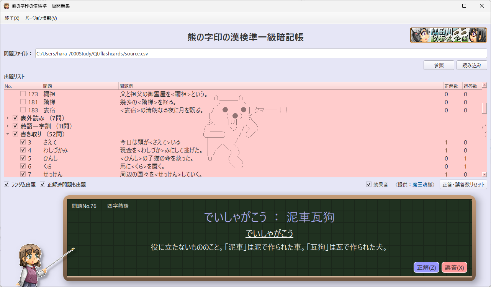

# 熊の字印の漢検準一級暗記帳

Windows / Android で動作する、Qt / C++ / QML 製の漢検準一級向け暗記アプリです。  
CSV から問題を読み込み、出題範囲を選びながら、正答数・誤答数を記録して復習できます。



## 概要

**熊の字印の漢検準一級暗記帳** は、漢検準一級レベルの語句を効率よく覚えるためのフラッシュカード型学習アプリです。

問題データは CSV ファイルとして管理します。アプリ上で問題を解き、正解・誤答を記録すると、その結果が CSV に保存されます。出題ジャンルを選んだり、ランダム出題にしたり、正解済み問題を除外したりしながら学習できます。

> 準一級に拘る必要が無い気がします。

## 主な機能

- CSV ファイルから問題データを読み込み
- 7種類の出題ジャンルに対応
  - 読み
  - 表外読み
  - 熟語一字訓
  - 書き取り
  - 四字熟語
  - 対義語類義語
  - 故事諺
- 出題リストから問題単位で出題 ON / OFF を切り替え
- ランダム出題に対応
- 正解済み問題を出題する / しないを切り替え
- 正答数・誤答数を CSV に保存
- 正答数・誤答数のリセット
- 効果音の ON / OFF
- キャラクター画像つきの QML 表示
- 問題・解答画面のフェード演出
- Windows / Android 向け表示切り替え

## 使い方

1. アプリを起動します。
2. `参照` から出題用 CSV ファイルを選択します。
3. `読み込み` を押して問題を読み込みます。
4. 出題リストで、出題したいジャンルや問題にチェックを入れます。
5. `答えを見る` で解答を表示します。
6. `正解` または `誤答` を選ぶと、次の問題に進みます。
7. 正答数・誤答数は CSV ファイルへ保存されます。

起動時は、実行ファイルと同じ場所にある `source.csv` をデフォルトの問題ファイルとして参照します。別の CSV を使う場合は `参照` から選んでください。

## キーボード操作

| キー | 動作 |
|---|---|
| `Space` | 答えを見る |
| `Z` | 正解として次へ進む |
| `X` | 誤答として次へ進む |

## CSV 形式

出題データは UTF-8 の CSV ファイルで管理します。

```csv
No.,種類（1.読み 2.表外読み 3.熟語一字訓 4.書き取り 5.四字熟語 6.対義語類義語 7.故事諺）,問題,問題例,解答,備考,正解数,間違い数
21,1,衿契,二人は<衿契>の間柄だ。,きんけい,心を許し合った友。非常に親しい交わり。,0,0
```

### 列の意味

| 列 | 内容 |
|---|---|
| `No.` | 問題番号 |
| `種類` | 出題ジャンル番号 |
| `問題` | 問題として表示する語句 |
| `問題例` | 例文 |
| `解答` | 正解 |
| `備考` | 解説・補足 |
| `正解数` | 正解した回数 |
| `間違い数` | 間違えた回数 |

`問題例` の中で `<` と `>` で囲んだ部分は、アプリ上で下線表示されます。

```csv
二人は<衿契>の間柄だ。
```

現在の実装では簡易的にカンマ区切りで読み込むため、各項目の中にカンマを含めない形で作成してください。

## ビルド方法

### 必要なもの

- Qt 6.5 以降
- CMake 3.19 以降
- C++ ビルド環境

### Qt Creator を使う場合

1. Qt Creator でこのリポジトリを開きます。
2. `CMakeLists.txt` を読み込みます。
3. 対象 Kit を選択してビルドします。
4. 実行時に `source.csv` を読み込むか、アプリ上で任意の CSV を選択します。

### コマンドラインでビルドする場合

```sh
cmake -S . -B build
cmake --build build
```

## ファイル構成

| ファイル / ディレクトリ | 内容 |
|---|---|
| `main.cpp` | アプリのエントリーポイント |
| `mainwindow.cpp` / `mainwindow.h` | メインウィンドウ、出題制御、CSV 読み込み処理との連携 |
| `mainwindow.ui` | Qt Widgets 側の画面定義 |
| `tester.qml` | 問題・解答表示、効果音、キャラクター表示などの QML UI |
| `data_parse.cpp` / `data_parse.h` | CSV の読み込み・保存、正答数・誤答数の管理 |
| `resource.qrc` | 画像・効果音・QML の Qt リソース定義 |
| `source.csv` | サンプル問題データ |
| `image/` | アイコン、背景、キャラクター画像、スクリーンショット |
| `sound/` | 効果音ファイル |

## 制作

- 効果音提供：[魔王魂](https://maou.audio/) 様
- 制作：[隅田川散歩人企画](https://swalker.sakura.ne.jp)

## バージョン

Version 1.0.0
